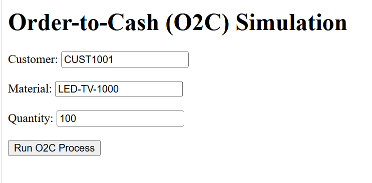
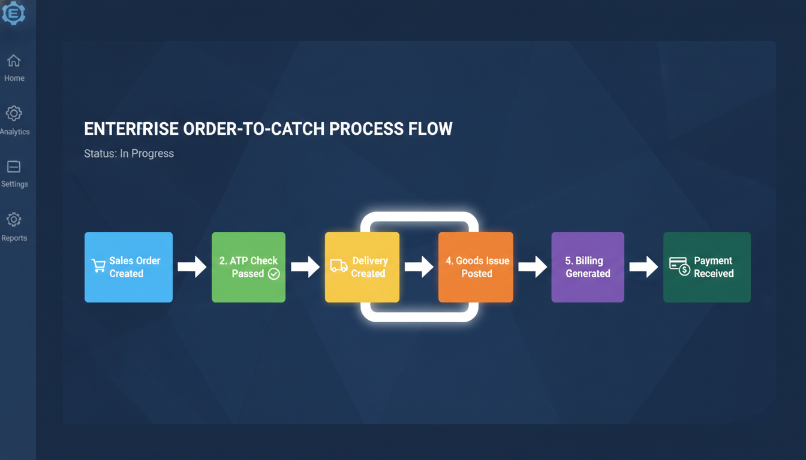

# SAP Project - Order-to-Cash (O2C) Simulation Dashboard  
**Name:** Ishan Gupta  
**Roll No:** 2306116  

A complete SAP-inspired project that simulates the Order-to-Cash (O2C) business process using a web application. The system mimics real SAP document flow, validates stock (ATP), performs transaction steps, and demonstrates financial postings with an interactive UI.


    

---

## At a Glance  
- End-to-end O2C process simulation  
- Sales Order → Delivery → Billing → Payment  
- ATP (Availability Check) validation  
- Financial accounting entries simulation  
- SAP table structure mapping  
- Interactive web interface  
- Easy to run locally  

---

## Repository Layout  

```
sap-o2c-final/  
├── app.py  
├── README.md  
├── requirements.txt  
├── services/  
│   ├── o2c_service.py  
│   ├── validation.py  
│   ├── accounting.py  
├── templates/  
│   ├── index.html  
│   ├── result.html  
├── static/  
│   ├── style.css  
├── data/  
│   ├── db.json  
├── abap/  
│   ├── z_o2c_report.abap
``` 

---

## What It Does  

1. User inputs customer, material, quantity  
2. Sales Order is created  
3. ATP Check validates stock  
4. If valid:  
   - Delivery created  
   - Goods Issue posted  
   - Billing generated  
   - Payment received  
5. Output displayed in SAP-like flow  

---

## Features  

### O2C Simulation  
- Sales Order  
- Delivery  
- Goods Issue  
- Billing  
- Payment  

### Validation  
- ATP Check  
- Stock verification  

### Financial Integration  
- COGS & Inventory posting  
- Revenue recognition  
- Bank transactions  

---

## Quick Start  

### Install Dependencies  
```
python -m venv venv  
venv\Scripts\activate  
pip install -r requirements.txt
``` 

### Run App 
```
python app.py
``` 

### Open Browser  
```
http://127.0.0.1:5000/
``` 

---

## Expected Output  

- Sales Order Created  
- ATP Check Passed  
- Delivery Created  
- Goods Issue Posted  
- Billing Generated  
- Payment Received  

---

## Visual Preview  

 

---

## Data Model  

Tables simulated:  
- VBAK (Sales Header)  
- VBAP (Items)  
- LIKP (Delivery)  
- VBRK (Billing)  

Accounting:  
- Dr COGS / Cr Inventory  
- Dr Customer / Cr Revenue  
- Dr Bank / Cr Customer  

---

## Project Report  
- [PROJECT_REPORT.pdf](PROJECT_REPORT.pdf) 

---

## Future Improvements  

- SAP Fiori UI  
- Dashboard analytics  
- Database integration  
- Cloud deployment  

---

## Author  

Ishan Gupta (2306116)